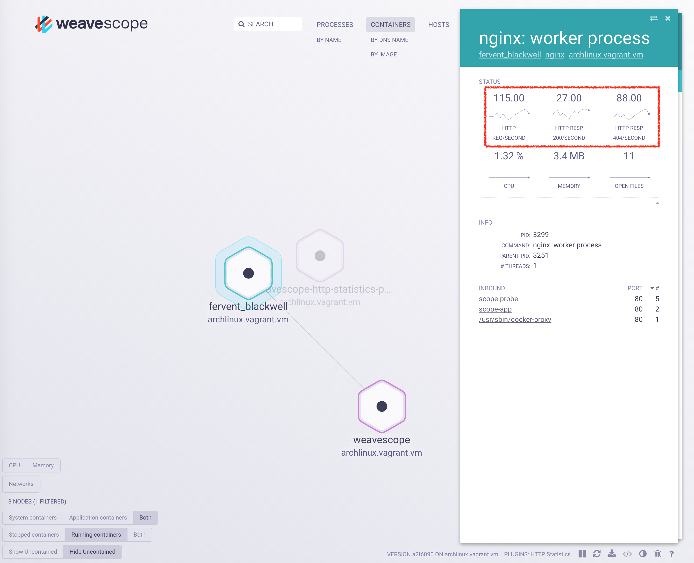

# DEPRECATED: Scope HTTP Statistics Plugin

The Scope HTTP Statistics plugin provides HTTP traffic statistics to the [Weave Scope](https://github.com/weaveworks/scope) user using [eBPF](http://man7.org/linux/man-pages/man2/bpf.2.html).
The HTTP Statistics plugin does not use any application-level instrumentation, it has a negligible performance toll (metrics are obtained in-kernel without any packet copying to user space).

**Note:** This plugin needs a [recent kernel version with eBPF support](https://github.com/iovisor/bcc/blob/master/INSTALL.md#kernel-configuration).
It will not compile on current [dlite](https://github.com/nlf/dlite) and boot2docker hosts.
You need `/sys/kernel/debug/` in order to be able to build the eBPF program generated by the plugin.



## How to Run Scope HTTP Statistics Plugin

This plugin requires:

* kernel version [>=4.2](https://github.com/iovisor/bcc/blob/master/docs/kernel-versions.md)
 * Attaching to kprobes requires >=4.1.
 * `bpf_probe_read()` requires >=4.1.
 * `bpf_get_current_pid_tgid()` requires >=4.2.
* Kernel build directory to be available in `/lib/modules/<kernel-version>/build`. Depending on your distribution you might need to add this symlink: `ln -s /lib/modules/<kernel-version>/build /lib/modules/<kernel-version>/source`.

The Scope HTTP Statistics plugin can be executed stand alone.
It will respond to `GET /report` request on the `/var/run/scope/plugins/http-statistics/http-statistics.sock` in a JSON format.
If the running plugin has been registered by Scope, you will see it in the list of `PLUGINS` in the bottom right of the UI (see the green rectangle in the above figure).
The measured values are shown in the *STATUS* section (see the circle in the above figure).

### Using a pre-built Docker image

If you want to make sure of running the latest available version of the plugin, you can pull the image from docker hub.

```console
docker pull weaveworksplugins/scope-http-statistics:latest
```

To run the Scope HTTP Statistics plugin you just need to run the following command.

```console
sudo docker run --rm -it \
	  --privileged --net=host --pid=host \
	  -v /lib/modules:/lib/modules \
	  -v /usr/src:/usr/src \
	  -v /sys/kernel/debug/:/sys/kernel/debug/ \
	  -v /var/run/scope/plugins:/var/run/scope/plugins \
	  --name weaveworksplugins-scope-http-statistics weaveworksplugins/scope-http-statistics
```

### Kubernetes

If you want to use the Scope HTTP Statistics plugin in an already set up Kubernetes cluster with Weave Scope running on it, you just need to run:

```console
kubectl create -f https://raw.githubusercontent.com/weaveworks-plugins/scope-http-statistics/master/deployments/k8s-http-statistics.yaml
```

### Recompiling
* Run the HTTP Statistics plugin
	* `git clone git@github.com:weaveworks-plugins/scope-http-statistics.git`
	* `cd scope-http-statistics; make`

## Testing

* Run an `nginx` instance `docker run --rm --name http-statistics-nginx -p 8080:80 nginx`
* Run `sh test-http-statistics.sh`, press Ctrl+c to terminate the test.
* Go to the Weave Scope UI [http://localhost:4040](http://localhost:4040).
* Open the `http-statistics-nginx` container.
* Click on `nginx: worker process` in the "Processes" table.

## Metrics
The HTTP Statistics plugin currently implements the following metrics:

* HTTP Requests rate (per second)
* HTTP Response Codes rate (per second), for the most common HTTP response codes.

### HTTP Requests
The HTTP Requests metric is the number of requests per second received by a process.
Weave Scope UI shows this information as single value and graph which are updated every second.
The single value is the latest value measured, while the graph is the historical representation of recents values.

### HTTP Response Codes
Currently the following HTTP Response codes are tracked:

* 100: Continue
* 200: OK
* 201: Created
* 202: Accepted
* 204: No Content
* 308: Permanent Redirect Redirect
* 400: Bad Request
* 401: Unauthorized
* 403: Forbidden
* 404: Not Found
* 408: Request Timeout
* 451: Unavailable For Legal Reasons
* 500: Internal Server Error
* 501: Not Implemented
* 502: Bad Gateway
* 503: Service Unavailable
* OTHERS: Every other code not specified above

For each code, the scope UI shows as single value and graph which are updated every second.
The single value is the latest value measured, while the graph is the historical representation of recent values.
**Note**: If a HTTP response code is never sent, the plugin will not report about it in order to avoid displaying plenty of empty graphs. When the traffic stops containing a specific HTTP response code, the corresponding graph will be removed from the Weave Scope UI.

## Plugin internals

Below you see the `Plugins` section of the [reporter interface](https://github.com/weaveworks/scope/tree/master/examples/plugins#reporter-interface).

```json
{
  "Plugins": [
    {
      "id":          "http-statistics",
      "label":       "HTTP Statistics",
      "description": "Adds http request metrics to processes",
      "interfaces":  ["reporter"],
      "api_version": "1",
    }
  ],
  ...
}
```

The HTTP Statistics plugin also has a `Processes` section, where the per process metrics are stored, an example of which you'll find below.

```json
{
  ...
  "Process": {
    "metric_templates": {
      "http_requests_per_second": {
        "id": "http_requests_per_second",
        "label": "HTTP Req/Second",
        "priority": 0.1
      },
      "http_200_responses_per_second": {
        "id": "http_200_responses_per_second",
        "label": "HTTP Resp 200 /Second",
        "priority": 0.2
      }
    },
    "nodes": {
      "example.org;29770": {
        "metrics": {
          "http_requests_per_second": {
            "samples": [
              {
                "date": "2016-09-21T07:22:24.293175Z",
                "value": 1.0
              }
            ]
          }
        }
      }
    }
  }
}
```

`Processes` has a single `metric_template` array field containing one or more elements.
These elements describe the various types of metrics contained by each element of the `nodes` field.
Each element in the `nodes` section identifies a process on a specific host.
The element identifier is generated by concatenating the hostname and the PID with `;` as delimiter (e.g. `example.org;29770`).
Each element contains the metrics data provided by the HTTP Statistics plugin (just one metric in the example).
The data may contain many samples (just one in the example).

## Getting help

We love hearing from you and encourage you to join our community. For more
information on how to get help or get in touch, see [Scope's help
section](https://github.com/weaveworks/scope/#help).
